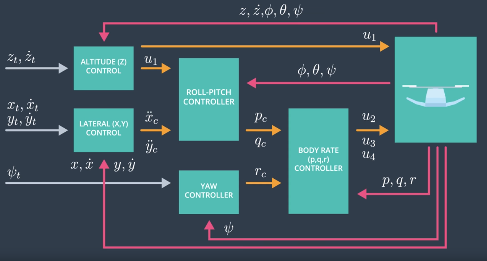

# FCND-Control-of-a-3D-Quadrotor
Third project in the Flying Car Nanodegree.

The goal of this project is to design and build a cascaded PID controller, which will control a quadrocopter to fly a trajectory in the 3D environment. The PID architecture is as follows:


This page contains the completed C++ controller `QuadController.cpp` and the associated gains `QuadControlParams.txt`. The page is structured following the projects rubric. The C++ solution code is given under each section. The implementation follows the excerise python code developed in the course.

For more details of the project as well as introduction to the setup can be found here: <br>
https://github.com/udacity/FCND-Controls-CPP#the-tasks.

## Motor commands
Although in the rubric Motor Commands appear at last, they are key in all Scenarios. Therefore I want to show them upfront. The thrust and moments are converted to the appropriate 4 different desired thrust forces for the moments. 

	float l = L / sqrt(2.f); // perpendicular distance to axes
	float p_bar = momentCmd.x / l; 
	float q_bar = momentCmd.y / l; 
	float r_bar = - momentCmd.z / kappa; 
	float c_bar = collThrustCmd; 
	
	cmd.desiredThrustsN[0] = (p_bar + q_bar + r_bar + c_bar) / 4.f; // front left
	cmd.desiredThrustsN[1] = (-p_bar + q_bar - r_bar + c_bar) / 4.f; // front right
	cmd.desiredThrustsN[2] = (p_bar - q_bar - r_bar + c_bar) / 4.f; // rear left
	cmd.desiredThrustsN[3] = (-p_bar - q_bar + r_bar + c_bar) / 4.f; // rear right

## Body rate and roll/pitch control (Scenario 2)
Next, we have to implement the body rate and roll and pitch controller. Verification of successful implementation is performed by running `Scenario 2`. In this scenario, a quad above hovers above the origin. It is created with a small initial rotation speed about its roll axis. The controller needs to stabilize the rotational motion and bring the vehicle back to level attitude.

### Body rate controller
The controller should be a proportional controller on body rates to commanded moments. The controller should take into account the moments of inertia of the drone when calculating the commanded moments.

Solution code is shown below.
```
  V3F MI;
  MI.x = Ixx;
  MI.y = Iyy;
  MI.z = Izz;
  V3F err = pqrCmd - pqr;
  momentCmd = MI * kpPQR * err; 
```

### Roll pitch controller
The controller should use the acceleration and thrust commands, in addition to the vehicle attitude to output a body rate command. The controller should account for the non-linear transformation from local accelerations to body rates. Note that the drone's mass should be accounted for when calculating the target angles.
```
  float c_acc = -collThrustCmd / mass; //convert it to acceleration
  float b_x_c = accelCmd.x / c_acc;
  float b_y_c = accelCmd.y / c_acc;

  float b_x = R(0, 2);
  float b_x_err = b_x_c - b_x;
  float b_x_p_term = kpBank * b_x_err;

  float b_y = R(1, 2);
  float b_y_err = b_y_c - b_y;
  float b_y_p_term = kpBank * b_y_err;

  pqrCmd.x = (R(1, 0) * b_x_p_term - R(0, 0) * b_y_p_term) / R(2, 2);
  pqrCmd.y = (R(1, 1) * b_x_p_term - R(0, 1) * b_y_p_term) / R(2, 2);
  pqrCmd.z = 0;
```
### Results


## Position/velocity and yaw angle control (scenario 3)
Following, position, altitude and yaw control are implemented and tuned. For the simulation, Scenario 3 is used. This will create 2 identical quads, one offset from its target point (but initialized with yaw = 0) and second offset from target point but yaw = 45 degrees.

### Altitude Controller
The controller uses the down position and the down velocity to command thrust. The ouput is converted to thrust and that the thrust includes the non-linear effects from non-zero roll/pitch angles.

Additionally, the C++ altitude controller should contain an integrator to handle the weight non-idealities presented in scenario 4.
```
  float z_err = posZCmd - posZ;
  float z_err_dot = velZCmd - velZ;
  float b_z = R(2, 2);
  integratedAltitudeError = integratedAltitudeError + z_err * dt;

  float p_term = kpPosZ * z_err;
  float i_term = KiPosZ * integratedAltitudeError;
  float d_term = kpVelZ * z_err_dot;

  float u_1_bar = p_term + i_term + d_term + accelZCmd;

  float c = (u_1_bar - CONST_GRAVITY) / b_z;

  thrust = -mass * c;
```
### Lateral position controller
The controller should use the local NE position and velocity to generate a commanded local acceleration.
```
  //z-component => 0
  V3F kpPosXY0 = kpPosXY;
  kpPosXY0.z = 0;

  //z-component => 0
  V3F kpVelXY0 = kpVelXY;
  kpVelXY0.z = 0;
  
  // Needed for TestManyQuads Scenario
  if (velCmd.mag() > maxSpeedXY) velCmd = velCmd.norm() * maxSpeedXY;

  V3F pos_err = posCmd - pos;
  V3F pos_err_dot = velCmd - vel;
  V3F p_term_pos = kpPosXY0 * pos_err;
  V3F d_term_pos = kpVelXY0 * pos_err_dot;
  V3F pos_dot_dot_command = p_term_pos + d_term_pos + accelCmd;

  accelCmd = pos_dot_dot_command;

  // Needed for TestManyQuads Scenario
  if (accelCmd.mag() > maxAccelXY) accelCmd = accelCmd.norm() * maxAccelXY;
```
### Yaw controller
The yaw controller is implemented as a linear/proportional heading controller to yaw rate commands.
```
  // First Hint
  if (yawCmd > 0) 
	  yawCmd = fmodf(yawCmd, 2.f * F_PI);
  else 
	  yawCmd = fmodf(yawCmd, -2.f * F_PI);

  float psi_err = yawCmd - yaw;

  if (psi_err > F_PI) psi_err -= 2.f * F_PI;
  if (psi_err < -F_PI) psi_err += 2.f * F_PI;

  yawRateCmd = kpYaw * psi_err;
```
### Results


  
## Non-idealities and robustness (scenario 4)
In this part,  some of the non-idealities and robustness of a controller is shown. For this simulation, Scenario 4 is used. This is a configuration with 3 quads that are all are trying to move one meter forward. However, this time, these quads are all a bit different.

### Results


## Tracking trajectories

Finally the controller´s performance is tested against a trajectory. For this simulation, Scenario 5 is used. This scenario has two quadcopters following an eight pattern:

### Results


At last an impression of a bigger variety of quadrorotors flollowing a complex pattern with the same parameter set.


# Flight Evaluation
The results of each step have been given in the respective sections. At last I want to provide the tuned overall parameters. These have evolved over the complete project. So only optimizing for altitude control would result in a different parameter set, but these can handle all 5 scenarios including the multi drone scenario.
```
# Position control gains
kpPosXY = 30
kpPosZ = 20
KiPosZ = 33

# Velocity control gains
kpVelXY = 11
kpVelZ = 9

# Angle control gains
kpBank = 10
kpYaw = 2.8

# Angle rate gains
kpPQR = 92 , 92 , 6
```
